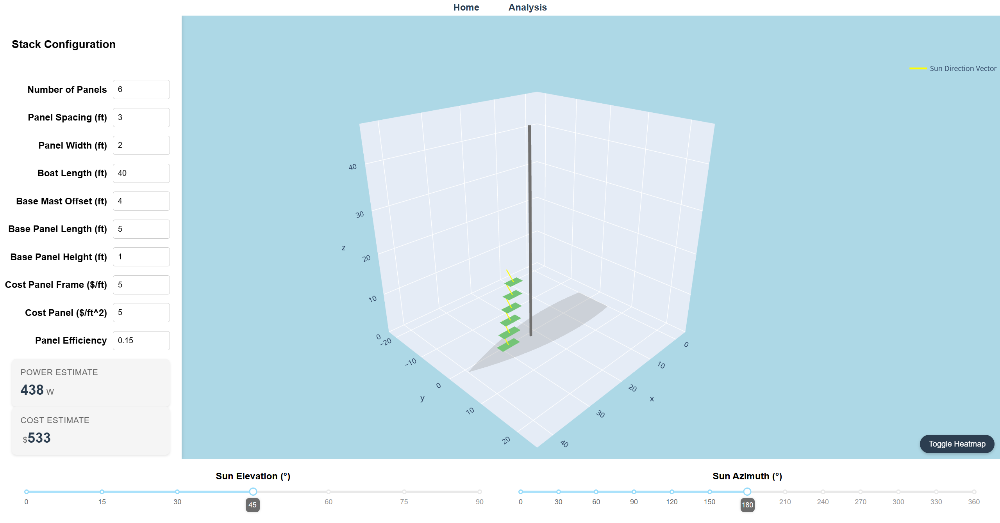

# Solar Stack for Sailboats

Interactive visualization and analysis for a solar panel array above the foredeck of a sailboat. 

*Solar panel array deployed on a sailboat.*

## Key Features
- Interactive 3D visualization of solar panel configurations
- Dynamic shadows with sliders for changing sun position (azimuth and elevation)
- Power generation estimates based on panel specifications and sun position
- Cost estimates and budget optimization plot
- Various inputs for boat geometry and stack size/location on boat

## Examples

*Interactive 3D viewer*

*Heatmap for power based on relative sun position*

*Budget vs power graph to find optimal stack configuration\(each point represents a unique stack configuration: spacing and width)*