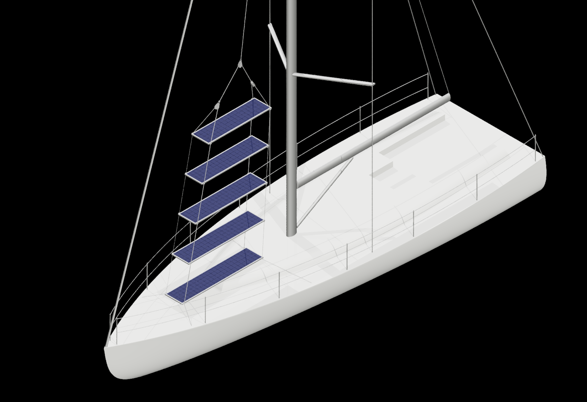

# Solar Stack for Sailboats

Interactive visualization and analysis of a solar panel array concept for sailboats. 

*Solar panel array deployed on a sailboat*

## Features
- 3D visualization of solar panel configurations
- Dynamic shadows with adjustable sun position
- Power generation and cost estimatations
- Analysis of power across sun positions and power vs. budget plot to find optimal configurations

### 3D Interactive Model 

*Interactive 3D visualization tool for analyzing stack configurations.*
- *Input boat geometry and panel specifications*
- *Adjustable sun position with sliders*
- *Shadows and power estimates based on sun direction (yellow vector)*

### Power vs. Sun Position

*Heatmap showing power generation across different relative sun positions.*

### Optimal Configuration Analysis

*Analysis of maximum average power achievable at different budgets to find an optimal configuration. Each point represents a unique stack configuration with different panel spacing and width.*

---
*This solar panel arrangement is patent pending (US Patent Application No. #19/009,990)*